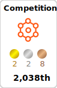
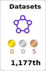
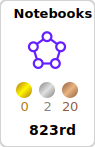
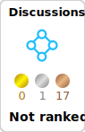

# 💫 About Me:

🚀  With 10+ years of experience in mathematics and statistics, the journey towards a career in data analysis began.

📊💡 Proficiency in data extraction, transformation, and visualization using Python and popular libraries like NumPy, Pandas, SciPy, Seaborn, and Matplotlib was honed. Additionally, expertise in SQL, Tableau, PowerBI was acquired, facilitating work with databases and creation of interactive data visualizations.

 📈💻 As a data scientist/analyst, a passion for solving complex problems and providing actionable insights through data-driven analysis is evident. 
 
💪💡 Strong analytical mindset, attention to detail, and effective communication skills add value to any data-focused team. Let's analyze the data together! 🚀🔍

## 🌐 Socials:

 

# 💻 Tech Stack:
                        

# 📊 GitHub Stats:
 
 

## 🏆 GitHub Trophies

# Projects

| Project Category | | Description | GitHub |
| --- | --- | --- | --- | 
| **Data Analysis - Python** |  | Explore various data analysis projects using Python, including data cleaning, visualization, and statistical analysis. |  |
| **Data Analysis - SQL** |  | Analyze datasets using SQL queries, focusing on extracting valuable insights and trends. |  |
| **Power BI** |  | Explore Power BI projects, including data visualization, data modeling, and interactive dashboards. This includes challenges and sample reports for improving your Power BI skills. |  |
| **Data Analysis - Tableau** |  | Utilize Tableau for data visualization and exploration, creating interactive dashboards to convey meaningful information. |  |
| **Looker Studio** |  | Create powerful and interactive dashboards using **Looker Studio**. This repository showcases various data visualization techniques, dynamic charts, and customizable reports to turn raw data into meaningful insights. Unlock the potential of data-driven decision-making! 📊 |  |
| **Data Analysis - Spreadsheets** |   | Perform data analysis using spreadsheet tools, demonstrating skills in data manipulation and visualization. |  |
| **NLP (Natural Language Processing)** |  | Apply NLP techniques for various projects, including sentiment analysis, text classification, and language modeling. |  |
| **Machine Learning** |  | Implement machine learning algorithms for various projects, showcasing classification, regression, and clustering models. |  |
| **Deep Learning** |  | Explore deep learning projects, including neural networks and deep neural network architectures, for tasks such as image recognition and natural language processing. |  |
| **Generative AI** |  | Explore Generative AI projects, including text generation, image synthesis, and innovative applications of AI in various fields. This includes examples, challenges, and resources to enhance your understanding of generative models. |  |
| **React Native** |  | Build cross-platform mobile applications using **React Native**. This repository includes examples of reusable components, navigation, API integration, and state management to create seamless Android and iOS apps. Dive into the world of modern mobile development! 🚀 |  |

# Deployment Projects
| Project Name | Description | GitHub | Streamlit |
| --- | --- | --- | --- |
| **NER (Named Entity Recognition) Application with Gliner** | Extract Any Entity from Text with GLiNER. This is a Named Entity Recognition (NER) application powered by Gliner, implemented using Streamlit. NER allows users to identify and classify named entities in unstructured text. |  |  |
| **LangChain - Conversational AI with Gemini and OpenAI** | LangChain is a conversational AI application that leverages the power of the Gemini and OpenAI models to provide users with an interactive chat experience. Users can ask questions and receive answers based on the context provided by uploaded PDF documents. |  |  |
| **Auto Analytics: Advanced Estimation & Deployment 🛠️** | This project focuses on using machine learning algorithms to estimate car prices. Various regression algorithms were implemented, including: Linear Regression, Lasso Regression, Ridge Regression, Decision Tree, Random Forest, XGBoost. Model evaluation, grid-search, and cross-validation were performed, resulting in the following scores: |  |  |

<!-- Proudly created with GPRM ( https://gprm.itsvg.in ) -->

<picture>
  <source media="(prefers-color-scheme: dark)" srcset="https://raw.githubusercontent.com/CagatayAkkas/CagatayAkkas/output/github-contribution-grid-snake-dark.svg">
  <source media="(prefers-color-scheme: light)" srcset="https://raw.githubusercontent.com/CagatayAkkas/CagatayAkkas/output/github-contribution-grid-snake.svg">
  
</picture>

## :pushpin: Kaggle Badge

### ✍️ Random Dev Quote

### 🔝 Top Contributed Repo

---

<!-- Proudly created with GPRM ( https://gprm.itsvg.in ) -->
