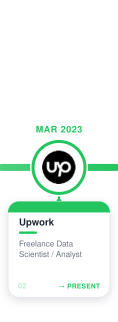
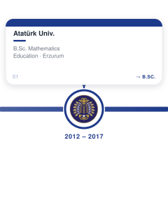
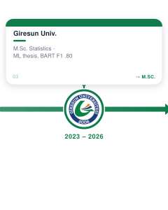
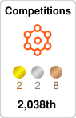
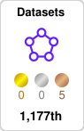
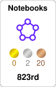
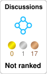

# 💫 About Me:

Highly analytical **Data Scientist** with a robust foundation in **Mathematics** and **Statistics**, backed by over 10 years of experience in education. Holds an **M.Sc. in Statistics** with a thesis that benchmarked **16 machine-learning models** for multi-class text classification on a 20K-article web-scraped dataset (best: **BART**, F1 **0.7955**). 

My professional journey is defined by a passion for transforming complex, unstructured data into actionable business intelligence through automation and machine learning. 

💪💡 Strong analytical mindset, attention to detail, and effective communication skills add value to any data-focused team. Let's analyze the data together! 🚀🔍

## 🌐 Socials:

 

---
 
### 🛠️ Technical Ecosystem

<!-- Every icon is a link (click -> the tool's site); hover for a one-line description. -->

<table>
<tr><td valign="top" width="50%">  <code>Python</code> (Pandas · NumPy · SciPy) · <code>SQL</code> · <code>R</code> · <code>JavaScript</code> · <code>Bash</code> · <code>HTML5</code> · <code>CSS</code> · <code>Regex</code></td><td valign="top" width="50%">  <code>scikit-learn</code> · <code>TensorFlow</code> · <code>Keras</code> · <code>PyTorch</code> · <code>MLflow</code> · <code>Pandas</code> · <code>NumPy</code> · <code>SciPy</code> — classification, regression, clustering, model evaluation &amp; tuning</td></tr>
<tr><td valign="top" width="50%">  <code>LangChain</code> · <code>Hugging Face</code> · <code>Anthropic</code> · <code>OpenAI</code> · <code>spaCy / NER</code> · <code>LLMs</code> · <code>RAG</code> · agents, prompt engineering &amp; evaluation frameworks</td><td valign="top" width="50%">  <code>Scrapy</code> · <code>Selenium</code> · <code>BeautifulSoup</code> · <code>Supabase</code> · <code>PostgreSQL</code> · <code>MongoDB</code> · <code>MS SQL Server</code> · <code>Elasticsearch</code> · <code>Typesense</code> · <code>Apache Kafka</code> — automated pipelines &amp; REST APIs</td></tr>
<tr><td valign="top" width="50%">  <code>Tableau</code> · <code>Power BI</code> · <code>Looker Studio</code> · <code>Matplotlib</code> · <code>Plotly</code> · <code>Google Sheets</code> · <code>Excel</code> — plus Seaborn</td><td valign="top" width="50%">  <code>AWS (Lambda · S3 · EC2)</code> · <code>GCP</code> · <code>Docker</code> · <code>Linux</code> · <code>FastAPI</code> · <code>Streamlit</code> · <code>Gradio</code> · <code>Dokploy</code> · <code>React Native</code></td></tr>
</table>

---

### 📈 Professional Highlights

- **Data Science:** Specialized in building agentic workflows (Tagger, Extractor, Consolidator) and fine-tuning models for niche sectors like energy and clinical data.
- **Automation:** Expert in developing end-to-end automation systems, including large-scale data extraction and automated content management via WordPress REST APIs.
- **Academic Focus:** Completed M.Sc. thesis research on the comparative performance of 16+ machine learning models for advanced text classification.

---

### 🗓️ Career Timeline

<!-- Every node is a clickable link — click to open the company/site, hover for role + dates. -->

  <b>Open ↴</b>&nbsp;
  <a href="https://www.linkedin.com/in/huseyincenik">Math Teacher</a> ·
  <a href="https://www.upwork.com/">Upwork</a> ·
  <a href="https://enkiai.com/">EnkiAI</a> ·
  <a href="https://theglobby.com/en/">The Globby</a> ·
  <a href="https://www.johnsnowlabs.com/">John Snow Labs</a> ·
  <a href="https://www.westaco.com/">Westaco</a> ·
  <a href="https://github.com/apps/free-pr-reviewer">AI PR Reviewer</a>

---
### 💼 Professional Experience

- **Creator | [AI PR Reviewer](https://github.com/apps/free-pr-reviewer)** · GitHub App (Jul 2026 – Present)
  - Designed and shipped a free, bring-your-own-key GitHub App that automatically reviews every pull request for bugs, security issues, and performance problems — running entirely on GitHub Actions and costing **$0 to operate**, since it calls OpenRouter's free LLM models with each user's own key instead of a metered backend. Built the full pipeline solo: GitHub App auth, a Cloudflare Workers setup dashboard with a live free-model picker, encrypted secret provisioning, and automatic model fallback for rate-limited requests. [Install it →](https://github.com/apps/free-pr-reviewer)

- **Senior Data Scientist | [Westaco](https://www.westaco.com/)** · Freelance · Romania · Remote (Feb 2026 – Apr 2026)
  - AI-powered chatbot development and LLM integrations. Optimized the end-to-end chatbot architecture (**+15%** response accuracy, **−20%** latency), integrated multi-provider LLM APIs (OpenAI, Anthropic) with fallback mechanisms (**99.5%** uptime), built async services with FastAPI / Flask, and implemented RAG pipelines on ChromaDB / Pinecone (**+22%** factual retrieval accuracy) with structured output guardrails.

- **Data Scientist | [John Snow Labs](https://www.johnsnowlabs.com/)** · Contract · Remote (Dec 2025 – Present)
  - Led end-to-end data curation for healthcare and clinical text datasets (**+25%** pipeline efficiency); cleaned, normalized and annotated large-scale medical text (**+30%** consistency); labeled clinical entities with domain-specific frameworks (**+20%** NER, classification and information-extraction accuracy); ran QA reviews, validation checks and feedback loops (**+25%** annotation accuracy and compliance) for NLP and LLM model development.

- **Senior Data Scientist | [The Globby](https://theglobby.com/en/)** · Full-time · Remote (Feb 2025 – Present)
  - Architected scalable web-scraping bots and automated pipelines in Python (**−75%** manual reporting time); integrated UN Comtrade and Trademap APIs into Supabase across **240+ countries**; engineered LLM-driven B2B buyer targeting and automated smart email generation — contributing to the platform's 🏆 **[2nd place at the WTO Small Business Champions 2026](https://www.wto.org/english/news_e/news26_e/igmsm_29jun26_436_e.htm)**. Managed Hetzner (Linux/Docker) infrastructure at **99.9%** uptime.

- **Data Scientist → Senior Data Scientist | [EnkiAI](https://enkiai.com/)** · Full-time · Remote (Feb 2024 – Present)
  - Own NLP and LLM-based systems end-to-end for the energy sector, from experimentation to production. Design, optimize and scale Retrieval-Augmented Generation (RAG) pipelines (**+20%** response relevance), define evaluation and monitoring frameworks for fine-tuned models, lead data-labeling and QA, and mentor junior data scientists. Promoted to Senior Data Scientist in Sep 2025.

- **Data Scientist / Data Analyst | [Upwork](https://www.upwork.com/)** · Freelance · Remote (Mar 2023 – Present)
  - End-to-end ML for clients — Customer Segmentation, Churn Prediction, Sentiment Analysis, RFM and Cohort analysis — using Logistic / Linear Regression, Random Forest, Gradient Boosting, clustering and deep learning (TensorFlow, Keras). Model deployment via Streamlit, AWS SageMaker / EC2 / Lambda / boto3; large-scale web scraping (Scrapy, Selenium, BeautifulSoup); Power BI dashboards; **1M+** records handled with Supabase and external APIs.

- **Mathematics Teacher | Private Lessons** · Part-time · Erzurum / Giresun · Hybrid (Sep 2012 – Present)
  - 14 years designing personalized, data-informed lesson plans from student-performance analysis — **+40%** overall success, **+28%** course success, and a **−25%** mathematics failure rate.

---

### 🎓 Education & Background

<!-- Click a node to open the university / profile; hover for the degree. -->

- 🎓 **M.Sc. in Statistics** — [Giresun University](https://www.giresun.edu.tr/) (2023 – 2026) · thesis: 16-model ML benchmark on 20K web-scraped articles, **BART F1 0.7955**
- 🎓 **B.Sc. in Mathematics Education** — [Atatürk University](https://www.atauni.edu.tr/), Erzurum (2012 – 2017)
- 🏫 **14 years** teaching Mathematics & pedagogical leadership (since 2012)

---

### 📄 Academic Research

**M.Sc. Thesis:** *Modeling of Data Obtained by Web Scraping Using Machine Learning Methods and Performance Comparison*

Benchmarked **16 machine learning models** (Transformers, RNNs, and traditional ML) on a 20K-article web-scraped maritime news dataset for multi-class business-event classification. **BART** achieved the best F1 Score (0.7955) among all models.

---

# 📊 GitHub Stats:
 
 

## 🏆 GitHub Trophies

# 📂 Projects

<table>
<tr><td valign="top" width="33%"><a href="https://github.com/huseyincenik/data_science/tree/main">&nbsp;<b>Data Analysis · Python</b></a> Cleaning, EDA, visualisation and statistical analysis in Python.</td><td valign="top" width="33%"><a href="https://github.com/huseyincenik/SQL---Structured-Query-Language/tree/main">&nbsp;<b>Data Analysis · SQL</b></a> Extracting insights and trends straight from SQL queries.</td><td valign="top" width="33%"><a href="https://github.com/huseyincenik/power_bi">&nbsp;<b>Power BI</b></a> Data modelling, interactive dashboards and report challenges.</td></tr>
<tr><td valign="top" width="33%"><a href="https://github.com/huseyincenik/tableau">&nbsp;<b>Tableau</b></a> Interactive dashboards and visual data exploration.</td><td valign="top" width="33%"><a href="https://github.com/huseyincenik/looker_studio">&nbsp;<b>Looker Studio</b></a> Dynamic cloud dashboards and customisable reports.</td><td valign="top" width="33%"><a href="https://github.com/huseyincenik/spreadsheets">&nbsp;<b>Spreadsheets</b></a> Data manipulation and analysis with spreadsheet tooling.</td></tr>
<tr><td valign="top" width="33%"><a href="https://github.com/huseyincenik/nlp_natural_language_processing">&nbsp;<b>NLP</b></a> Sentiment analysis, text classification and language modelling.</td><td valign="top" width="33%"><a href="https://github.com/huseyincenik/machine_learning">&nbsp;<b>Machine Learning</b></a> Classification, regression and clustering implementations.</td><td valign="top" width="33%"><a href="https://github.com/huseyincenik/deep_learning">&nbsp;<b>Deep Learning</b></a> Neural networks for image recognition and NLP tasks.</td></tr>
<tr><td valign="top" width="33%"><a href="https://github.com/huseyincenik/generative_ai/tree/main">&nbsp;<b>Generative AI</b></a> Text generation, image synthesis and applied GenAI experiments.</td><td valign="top" width="33%"><a href="https://github.com/huseyincenik/react_native">&nbsp;<b>React Native</b></a> Cross-platform mobile apps: components, navigation, state.</td></tr>
</table>

# 🚀 Live Apps

<table>
<tr><td valign="top" width="33%"><a href="https://ner-with-gliner.streamlit.app/">&nbsp;<b>NER with GLiNER</b></a> Extract any entity from unstructured text — a GLiNER-powered NER app. <a href="https://ner-with-gliner.streamlit.app/">▶ Live app</a> &nbsp;·&nbsp; <a href="https://github.com/huseyincenik/streamlit_ner_with_gliner">Code</a></td><td valign="top" width="33%"><a href="https://chat-with-multiple-pdfs-langchain.streamlit.app/">&nbsp;<b>Chat with your PDFs</b></a> Conversational Q&amp;A over uploaded PDFs with Gemini + OpenAI via LangChain. <a href="https://chat-with-multiple-pdfs-langchain.streamlit.app/">▶ Live app</a> &nbsp;·&nbsp; <a href="https://github.com/huseyincenik/streamlit_langchain">Code</a></td><td valign="top" width="33%"><a href="https://auto-price-deployment.streamlit.app/">&nbsp;<b>Auto Analytics</b></a> Car-price estimation with Linear / Ridge / Lasso, Random Forest and XGBoost. <a href="https://auto-price-deployment.streamlit.app/">▶ Live app</a> &nbsp;·&nbsp; <a href="https://github.com/huseyincenik/auto_analytics_advanced_estimation_and_deployment">Code</a></td></tr>
</table>

<!-- Proudly created with GPRM ( https://gprm.itsvg.in ) -->

<picture>
  <source media="(prefers-color-scheme: dark)" srcset="https://raw.githubusercontent.com/CagatayAkkas/CagatayAkkas/output/github-contribution-grid-snake-dark.svg">
  <source media="(prefers-color-scheme: light)" srcset="https://raw.githubusercontent.com/CagatayAkkas/CagatayAkkas/output/github-contribution-grid-snake.svg">
  
</picture>

## :pushpin: Kaggle Badge

### ✍️ Random Dev Quote

### 🔝 Top Contributed Repo

---

<!-- Proudly created with GPRM ( https://gprm.itsvg.in ) -->
